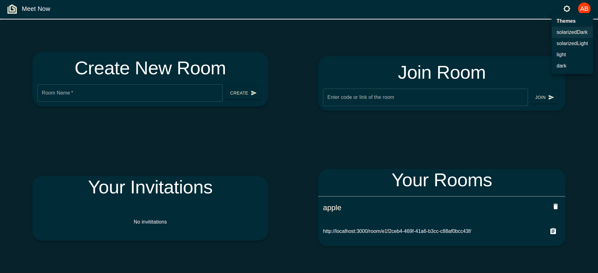
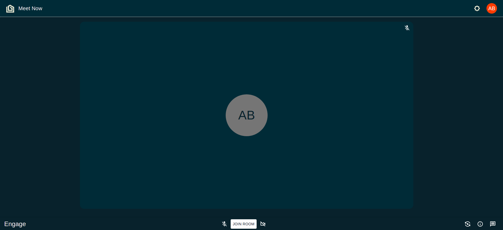

# Meet Now 👋

⭐️ Star it on GitHub — it motivates me a lot!

[Meet Now](https://meetnow.tech/) is a Video conferencing app based on peer to peer connection
 
 
 

### 🏠 [https://github.com/ayu023ban/teams-docker#readme](https://github.com/ayu023ban/teams-docker#readme)

### 🌐 [https://meetnow.tech/](https://meetnow.tech/)

 
 

## features

- Login with Google feature.
- Login with Facebook feature.
- Unlimited access to rooms
- Desktop and Mobile Compatible.
- Room Creation with name of your choice
- Individual unique links for each room with UUID to achieve uniqueness
- Join the room by either room url or by room code.Both will work.
- Permissions Feature: user will have to ask the creator of the room to join the room.
- Invite user to a room: the creator can invite specific users so that those people don't have to ask every time they want to join the room.
- Waiting room
- Enable/disable camera before joining the room
- Mute/unmute before joining the room
- Chat function inside the waiting room so that you don't have to join the room in case you only want to do chat conversations
- Individual chats for each room
- Saved Messages for each room so that user can go to room anytime and see previous and very old messages too.
- Pin a specific user.
- Kick the user out of the room (only for creator of the room).
- Block user permanently from joining the room (only for creator of the room).
- Enable/disable microphone
- Enable/disable camera
- Share the screen
- Switch camera in case of multiple cameras
- Invite the user by entering the email id of the user (user will be invited if he/she has logged in at least once).
- See meeting details and link to copy by clicking on meeting details.
- Cool Themes like light, dark, solarized_light, solarized_dark.
- After ending call you will be redirected to the waiting room again where you can again switch off your camera and talk to anybody in the room via chat.
- If you leave the waiting room and you were not invited then you will have ask for the permission from creator to join the room.

## SnapShots

- Login 

- Home

- Waiting Room

---

## Author

👤 **ayush bansal**

- Website: http://ayu023ban.github.io/
- Github: [@ayu023ban](https://github.com/ayu023ban)

## Show your support

Give a ⭐️ if this project helped you!
