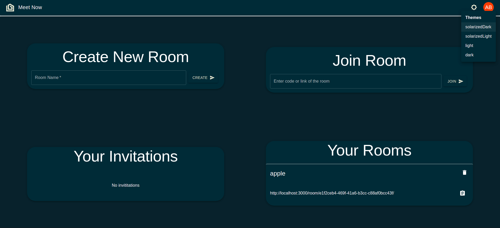

# Meet Now 👋

⭐️ Star it on GitHub — it motivates me a lot!

[Meet Now](https://meetnow.tech/) is a Video conferencing app based on peer to peer connection
 
 
 

### 🏠 [https://github.com/ayu023ban/teams-docker#readme](https://github.com/ayu023ban/teams-docker#readme)

### 🌐 [https://meetnow.tech/](https://meetnow.tech/)

 
 

## features

    - Room creations
    - individual chats for each room
    - invite user to room
    - kick user out of the room
    - block user permanently
    - permission to join the room
    - enable/disable microphone
    - enable/disable camera
    - switch camera in case of multiple cameras
    - share screen
    - user pin
    - waiting room to enable/disable camera and microphone before joining the room
    - Chat function inside the waiting room so that you don't have to join the room in case you only want to do chat conversations
    - Cool Themes

## SnapShots

- Login 

- Home

- Waiting Room

---

## Author

👤 **ayush bansal**

- Website: http://ayu023ban.github.io
- Github: [@ayu023ban](https://github.com/ayu023ban)

## Show your support

Give a ⭐️ if this project helped you!
